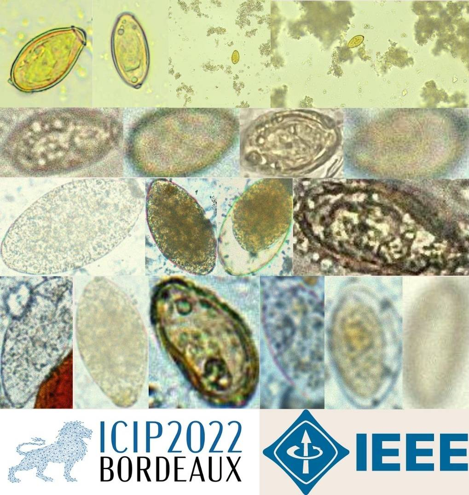

# MIFvsOV
Minute Fluke Egg and Opisthorchis Viverrini Detection and Classification 
https://mifvsov.herokuapp.com/

Training notebook: 
 
Dataset: [Eggs.zip](https://drive.google.com/file/d/1eo3-4ODNEwVi85MNfGSvZ3XWetZEgHem/view?usp=sharing) (from Phramongkutklao hospital's laboratory and ICIP 2022 challenge's datatset[^1])  
Example images batch:  

[^1]: Duangdao Palasuwan, Korranat Naruenatthanaset, Thananop Kobchaisawat, Thanarat H Chalidabhongse, Nuntiporn Nunthanasup, Kanyarat Boonpeng, Nantheera Anantrasirichai, January 22, 2022, "Parasitic Egg Detection and Classification in Microscopic Images", IEEE Dataport, doi: https://dx.doi.org/10.21227/vyh8-4h71.s 
